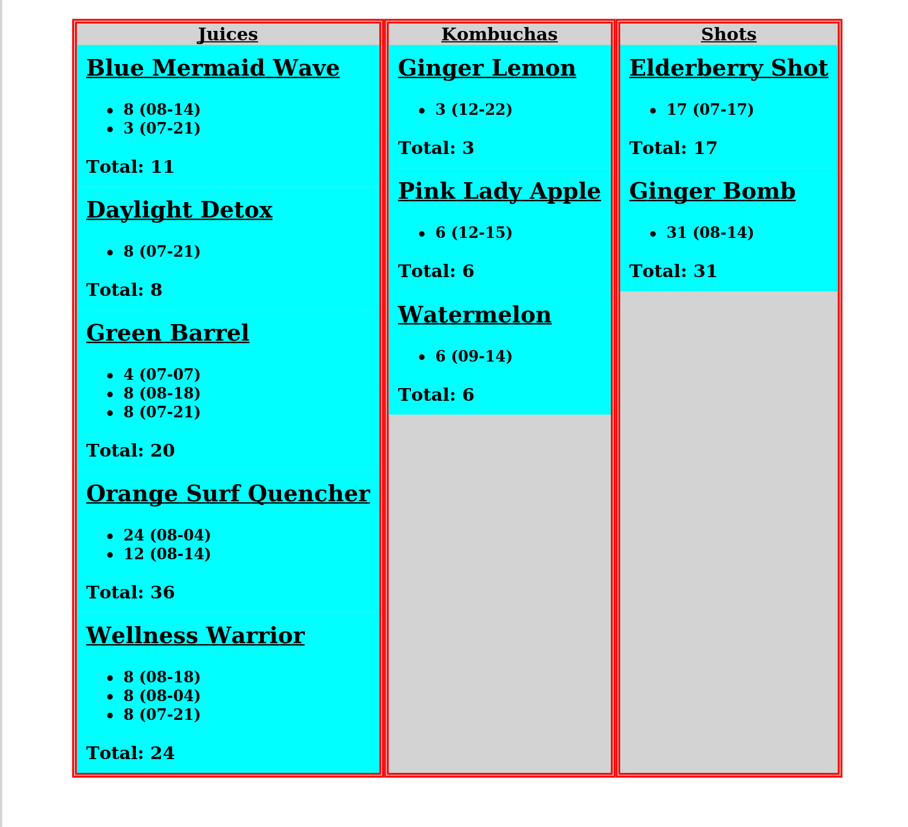

# Juices Inventory App

## Introduction

This is an app I wrote to help with inventory duties at the juice bar
[where I work currently](https://playabowls.com). Items are counted
from a dashboard GUI, and then the user can generate and download a
PDF report for further distribution.

Some screenshots:

- Dashboard for Counting Items:

- Generated PDF of Inventory Report:

Currently, it's available at [my
website](https://brandonirizarry.xyz).

The items in question are hardcoded according to where I work. They're
meant to keep track of a certain class of perishable items we sell -
namely, cold-pressed juices, and kombuchas. Part of the inventory
requirement is to include dates along with each count, so that, for
example, it's evident if a lot of juices of a certain flavor are going
to expire soon.

However, the inventory definition itself is by design modular and
easily editable and extensible.

## Installation

### Prerequisites

- Go 1.24+
- `wkhtmltopdf` for generating the report
- A web browser with JavaScript enabled

The HTMX library, while techincally also a requirement, doesn't need
to be installed separately, since it's bundled with the repo.

### Bare Metal Build

In a Bash shell, run the following:

1. `git clone https://github.com/BrandonIrizarry/Juices`
2. `cd Juices`
3. `go build ./cmd/server`
4. `./server`

The page will then be available  at `localhost:8080`. Port 8080 is the
default, though  this can be configured  using the `-p` switch  to the
server command. For example, to host the site at port 8100, do:

`./server -p 8100`

## Usage

Click on a product name to expand it. Then click the `Add Date` button
to add a date for that product. Use the supplied counter widget to
specify how many units of that product there are for that date. Then
click `Sync` to confirm your count.

You can use the `Delete` button to erase a given item count at any
time.

When finished, click the `Submit` button to generate a report page. If
you're satisfied with the results, click the `Prepare Download` button
to generate a report. When that's finished, click the now visible
`Download!` button to download the report as a PDF file, which you can
then share with whomever requires it.

## Stack

The frontend uses [HTMX](https://htmx.org), powered by a
[Go](https://go.dev) backend which manages all the `hx-*` endpoints,
as well as maintains an internal map of the currently tallied counts,
which is eventually used to generate the final report.

There is no persistent server-side storage of any sort, as none is
necessary (nor desirable.) The purpose is to generate a quick,
throwaway report on the fly.

## Possible Improvements

- Improve spacing between UI elements
- Organize items under categories (e.g. **Cold Pressed Juices**,
  **Kombuchas**)
- ~~Maybe add an option to clear all current counts~~
- Add progress indicator for downloading PDF
- Improve CSS for PDF generation indicator widget
- Add CD
- Check whether we should make certain endpoints forbidden
- Add screenshots
- Tidy the app's build steps and add an Installation section
- Containerization
- Fix a "stale" `counts` map

  The user currently has to check manually (clicking `Submit`) whether
  `counts` is populated from a previous session. A possible fix is to
  make the user begin a session by clicking a button to enter the
  page. This possibly necessitates getting rid of the "sitegen" step.
